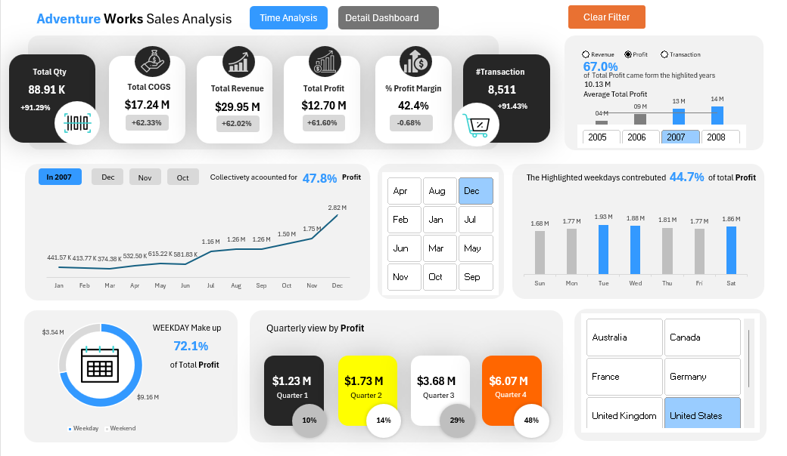
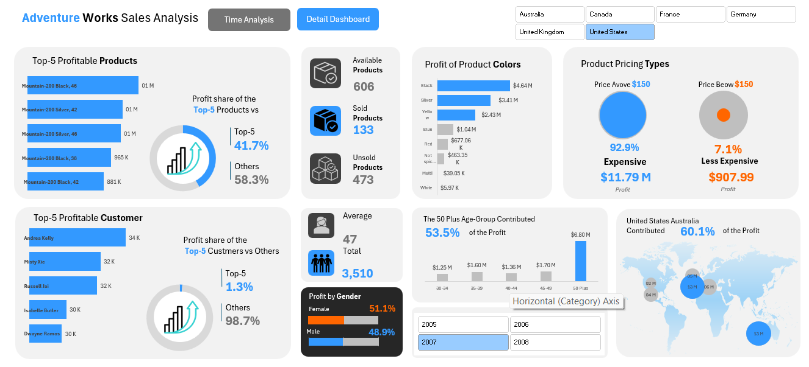

# 📊 AdventureWorks Sales Analysis

## 📌 Overview
This project analyzes sales data from the AdventureWorks dataset using Excel to uncover key insights about revenue, profitability, customer behavior, and regional performance.

The goal is to transform raw sales data into meaningful insights that support better business decision-making.

---

## 🎯 Problem Statement
Businesses need clear visibility into their sales performance to identify growth opportunities and improve profitability.

This project answers key questions such as:
- What are the main drivers of revenue and profit?
- Which products and customers contribute the most?
- How does performance vary across time and regions?
- Where should the business focus to improve results?

---

## 📂 Dataset
The dataset is based on the AdventureWorks sample database.

### Key Features:
- Sales transactions data  
- Product, customer, and geographic information  
- Revenue, Cost (COGS), and Profit metrics  

### Main Columns:
- Order Date  
- Product Name  
- Customer Name  
- Country / Region  
- Revenue  
- Cost (COGS)  
- Profit  

---

## 🧹 Data Preparation
To ensure data quality, the following steps were performed:

- Removed duplicate records  
- Standardized data formats (dates, numeric values)  
- Validated calculated fields (Revenue, Profit, COGS)  
- Cleaned and renamed columns for consistency  
- Verified overall data integrity  

---

## 🧱 Data Structure
A simplified analytical structure was used:

- **Fact Table:** Sales Transactions  
- **Dimensions:**  
  - Date (Year, Quarter, Month)  
  - Product (Category, Color, Price)  
  - Customer  
  - Geography (Country, Region)  

This structure allows multi-dimensional analysis across different business perspectives.

---

## 📈 Key Metrics
The dashboard focuses on the following KPIs:

- Total Revenue  
- Total Profit  
- Total COGS  
- Profit Margin (%)  
- Number of Transactions  
- Total Quantity Sold  

---

## 📊 Dashboard Features

### 🔹 Time Analysis
- Monthly and yearly trends  
- Seasonal performance insights  
- Identification of peak sales periods  

### 🔹 Product & Customer Analysis
- Top-performing products  
- Customer contribution analysis  
- Profit distribution by product attributes  

### 🔹 Geographic Analysis
- Performance comparison across countries  
- Identification of top and underperforming regions  

### 🔹 Interactivity
- Filters by Year, Month, and Country  
- Dynamic exploration of the data  

---

## 💡 Key Insights

- Q4 shows the highest profit compared to other quarters  
- The United States contributes the largest share of total profit  
- High-priced products generate most of the profit  
- A small group of products drives a large portion of revenue  
- Weekdays outperform weekends in profitability  

---

## 🚀 Business Recommendations

- Focus on high-margin products to maximize profit  
- Expand strategies in top-performing regions  
- Improve performance in low-performing markets  
- Leverage seasonal peaks (especially Q4)  
- Optimize pricing strategies based on product performance  

---

## 🛠 Tools Used
- Microsoft Excel  
- Data Analysis Techniques  
- Dashboard Design  

---

## 📸 Dashboard Preview

**Time Series**

**Details Analysis**

---

## 📁 Project Structure

AdventureWorks-Sales-Analysis  
│  
├── Data  
│   └── AdventureWorks.xlsx  
│  
├── Dashboard  
│   └── Dashboard_Screenshot.png  
│  
├── README.md  

---

## 👨‍💻 Author
**Abdallah Elsheemy**  
Data Analyst | BI Developer  

---

## 📬 Contact
- LinkedIn: https://www.linkedin.com/posts/abdallah-ashraf-799063366_excel-dataanalytics-powerquery-activity-7376595077978193920-4zNR?utm_source=social_share_send&utm_medium=member_desktop_web&rcm=ACoAAFrG3qUBnRDQMM149Oqm7lJCKvKiSZlJuR0  

---

## ⭐ Support
If you found this project useful, consider giving it a ⭐ on GitHub.
